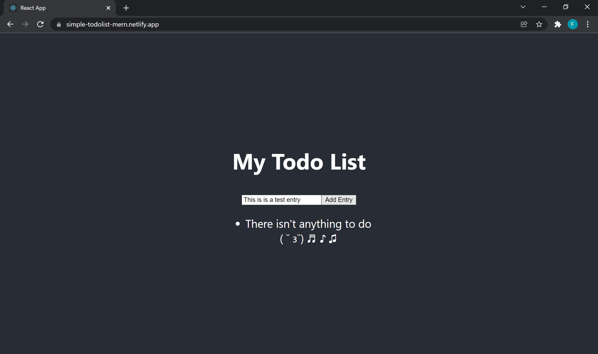
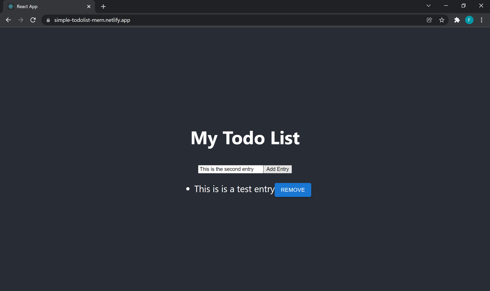
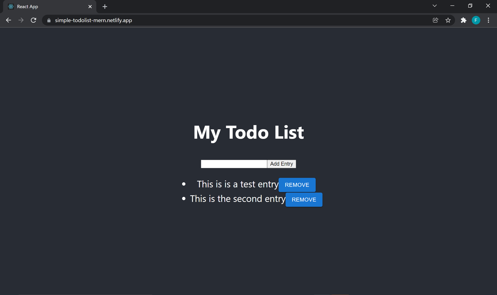

A simple client using React
==============

### [Live Demo](https://simple-todolist-mern.netlify.app/) | [Server Repository](https://github.com/Finneasles/simple-todo-app-server)

[](https://app.netlify.com/start/deploy?repository=https://github.com/Finneasles/simple-mern-todo-app-client
) 

---

## Prerequisites 
* [NodeJS](https://nodejs.org/en/)
* [MongoDB](https://www.mongodb.com/atlas/database)

## Technologies 
* [React](https://reactjs.org/)
* [Axios](https://axios-http.com/)
* [MUI](https://mui.com/)

## Run the Client
To start the server using the following command :

### Development
``` bash
$ npm start
```
- Open [http://localhost:3000](http://localhost:3000) to view it in your browser.

### Testing
``` bash
$ npm test
```
Launches the test runner in the interactive watch mode. [Learn More](https://facebook.github.io/create-react-app/docs/running-tests)

### Eject
``` bash
$ npm run eject
```
> ⚠️ **Warning:** this is a one-way operation. Once you `eject`, you can't go back!

### Production
``` bash
$ npm run build
```
<br>


### You can learn more in the [Create React App documentation](https://facebook.github.io/create-react-app/docs/getting-started).

---

## Screenshots 


*Adding an entry*



*Entry added. Writing a second entry*



*Second entry added.*


